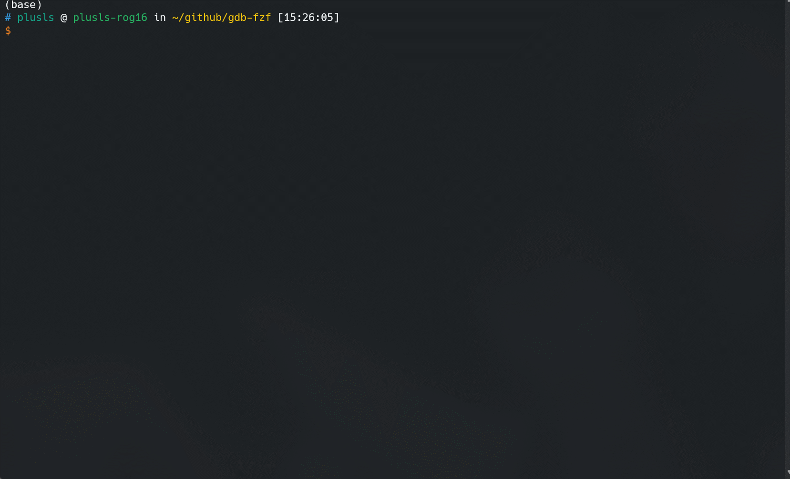

# GDB with fzf python plugin


This is a patch for GDB that integrates [FZF fuzzy finder](https://github.com/junegunn/fzf) with GDB's history search and auto complete.




## Installation

1. install fzf
    + For Debian/Ubuntu: `apt install fzf`
2. Add `source {Your download path}/gdb-fzf.py` to `~/.gdbinit`


You can turn off feature by commenting out

```python
    assert (libreadline.rl_bind_keyseq(b"\\C-r", fzf_search_history) == 0)
    assert (libreadline.rl_bind_keyseq(b"\\t", fzf_auto_complete) == 0)
```

And you also can add your key binding.

## Better GDB auto complete

Add to `~/.inputrc`

Warning: **It will effect all programs that use libreadline**

```
"\e[A": "\e[A": history-search-backward
"\e[B": history-search-forward
```

## Infinite GDB history

Set up infinite GDB history. Should be added to `~/.gdbinit`.

```gdb
# https://stackoverflow.com/a/3176802/6824752
set history save on
set history size unlimited
set history remove-duplicates unlimited
set history filename ~/.gdb_eternal_history
```


## More completions

Set up GDB `max-completions`. Should be added to `~/.gdbinit`.

```
set max-completions 0x10000 
```
## Reference

+ https://github.com/filipkilibarda/gdb_fzf_patch
